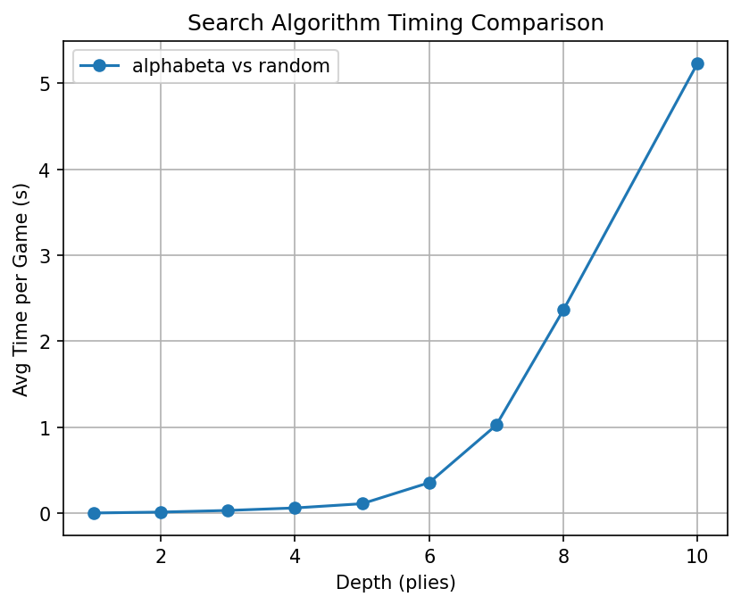
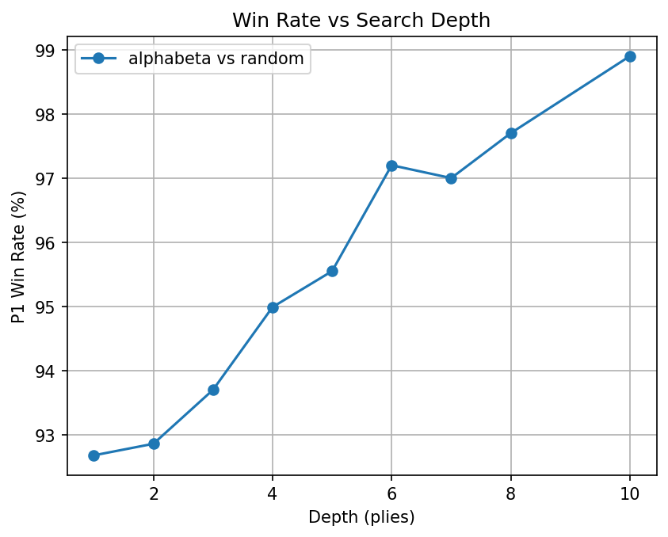
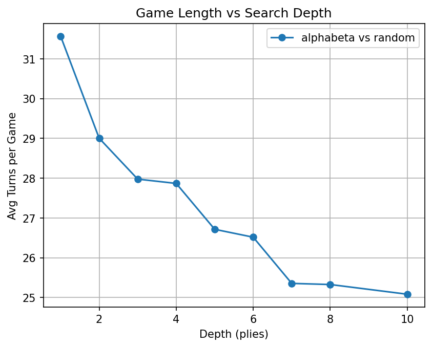
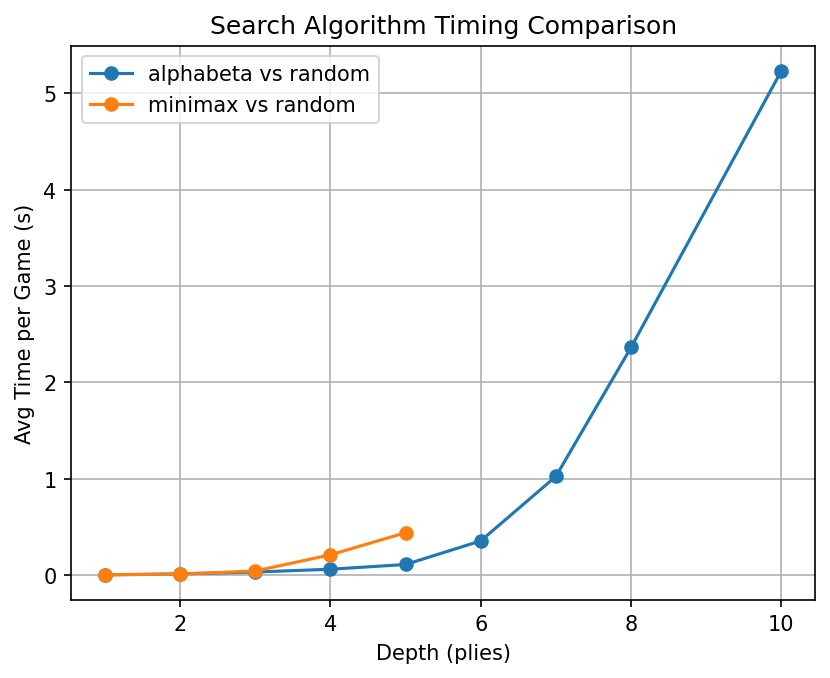
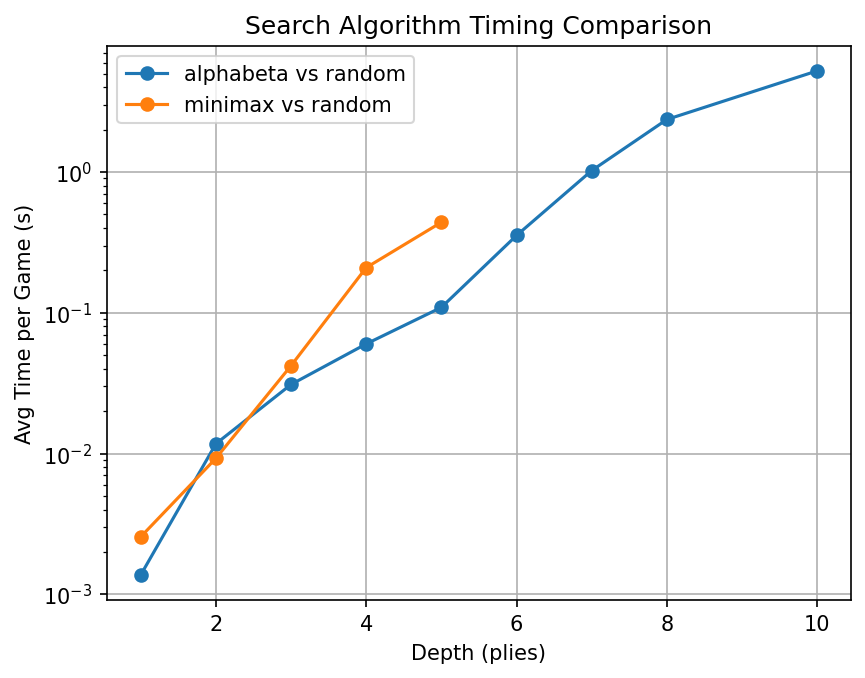
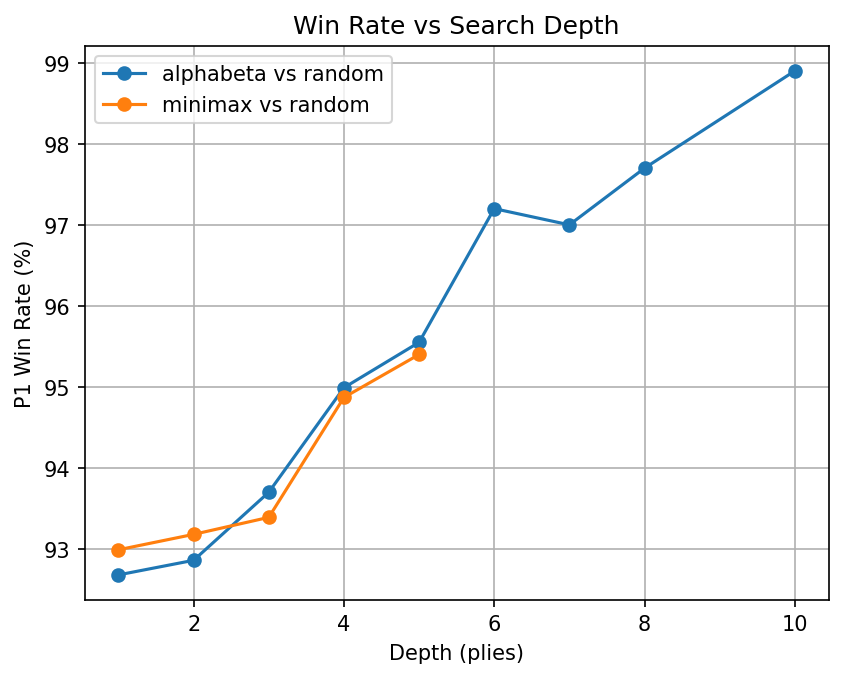
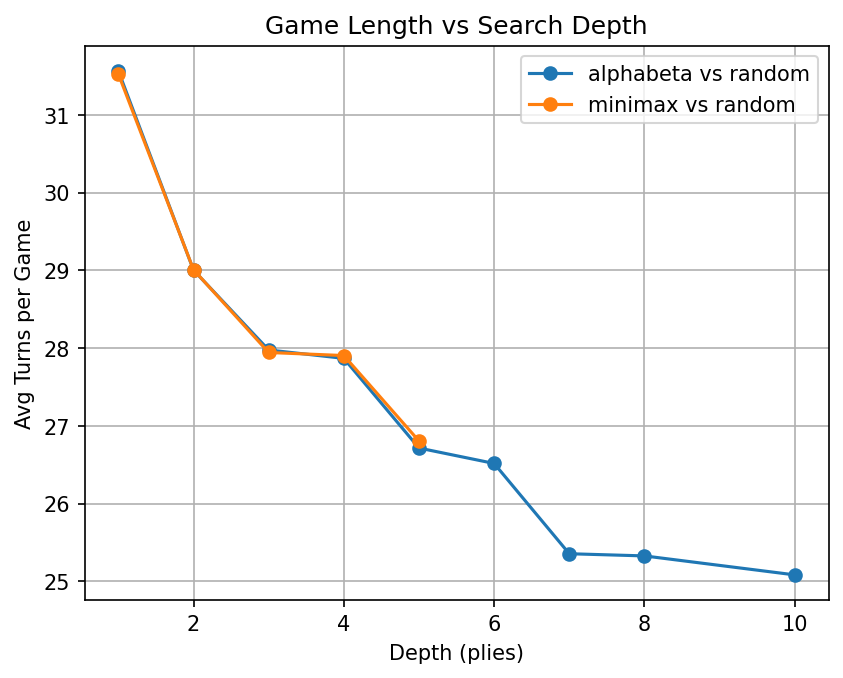

# Report
## Oppurtunities for optimization
- For alphabeta - order moves that are likely to be good to come first to encourage pruning (capture rule)
- Cache results for a given game state across games. This would make the first few moves instant
- Convert everything to numpy/JIT
- Convert everything to C

## Play 100 games of random player against random player

- What percentage of games does each player (1st or 2nd) win?

On average player 1 wins 48% of the time while player 2 wins 45.57% of the time with 6.3% being ties.

- On average, how many moves does it take to win?

On average it takes 41 moves for the game to finish. 

## Build an AI player that uses minimax to choose the best move with a variable number of plies and a utility function we describe

- What percentage of games does each player (AI or random) win?

Win rate starts at 93% at 1 plie and increases up to 95.5% at 5 plies with the biggest jump in performance when going from 3 plies to 4. 

- On average, how many moves does it take to win?

We can see that increasing depth seems to decrease game length.

- Is your AI player better than random chance? Write a paragraph or two describing or why not

Based off the charts above we can confidently say the AI is better than random chance. This is because it wins more and because it wins faster. I suspect it wins faster because the utility function incentvizes getting stones in the mancala. Doing so leads to less stones being on the board and thus shorter games. 

- Does your AI player have a better win rate as the number of plies increases? Why or why not?

Yes, my AI player has a better win rate as the number of plies increases. This makes sense because number of plies is the depth of the game tree you are searching. Intuitively, if I can see two moves ahead, I can make better decisions than if I can only see 1 move ahead. 

## Build an AI player that uses Alpha-Beta to choose the best move
## Play 100 games with the random player against the Alpha-Beta AI player at a depth of 5 plies.

### How long does it take for a single game to run to completion?

At a depth of 5 each game takes 0.066 seconds against a random player at a depth of 5.

### What percentage of games does each player (AI or random) win?

At a depth of 5 the win rate against a random player is 96.1%.

- On average, how many moves does it take to win?

On average at a depth of 5 plies alphabeta vs random take 26.8 moves. 

- Are your results for this part different from those for your minimax AI player?

Looking at both minimax and alphabeta side by side we can see the only major difference is in the amount of time it takes to complete a game. That difference is much clearer when we plot the log of the timing information. The gap in runtime appears to increase as plies increases. This is all expected.
The reason why win rate and turn count are largely the same is that they are constructing the same game tree. Therefore, given the other player always plays the same moves, minimax and alphabeta should produce identical sets of moves to each other and thus have the same game length and win rate. 
The reason why minimax takes longer, especially at higher plies, is minimax always explores the full game tree before deciding on a move. Alphabeta, however, does not consider branches of the tree that will result in non-optimal play. So this means routes where you or your oponent makes a bad move are not considered. That means it will reach a decision on the next move faster. I expect that the performance gap would continue to widden as successful prunes would mean greater and greater time savings. 

## Play 100 games with the random player against the Alpha-Beta AI player at a depth of 10 plies
NOTE: It may take between 10 minutes and 2 hours to run 100 games at 10 plies depending on how you have coded your project
- How long does it take forgle game to run to completion?
- What percentage of games does each player (AI or random) win?
- On average, how many moves does it take to win?
- How much does the Alpha Beta algorithm speed up the game. Compare your run time for 5 ply minimax against 5 ply Alpha Beta. Project how long
- Minimax would take to run 10 plies.
- Plot a curve showingthe win percentage for a player looking ahead 2 plies, 5 plies and 10 plies
- As you increase the number of plies, does the AI player win more games? Explain why or why not.
## (Extra Credit, 20 points). Change the utility function and play 100 games with the random player against the Alpha-Beta AI player at a depth of 2 and 5 plies or more
- How long does it take for a single game to run to completion?
- What percentage of games does each player (AI or random) win?
- On average, how many moves does it take to win?
- In your writeup, explain how your new utility function improves on the utility function described above?
- Explain how increasing the number of plies improve the play for the AI player?
- Is this new utility function a better way to evaluate the stkkrength of a particular match? Explain how?
